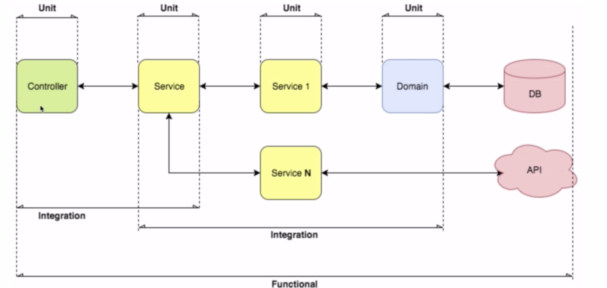

# 1. Testing and Integration with go

<!-- TOC -->

- [1. Testing and Integration with go](#1-testing-and-integration-with-go)
  - [2. Course Repo](#2-course-repo)
  - [2.1. Types of testing](#21-types-of-testing)
  - [2.2. Artifacts of each Test Type](#22-artifacts-of-each-test-type)
  - [2.3. Pyramid of Tests](#23-pyramid-of-tests)
  - [3. Steps to follow when writing a test cast](#3-steps-to-follow-when-writing-a-test-cast)
  - [3.1. Test Coverage](#31-test-coverage)
  - [Benchmark Testing](#benchmark-testing)

<!-- /TOC -->

## 2. Course Repo

```sh
git clone https://github.com/federicoleon/golang-testing.git
```

## 2.1. Types of testing


**Unit:** Test code to make sure functions and Modules work

- White box testing (best to encapsulate all logic in testing)
- Black Box testing: without regard to code

**Integration:** Integrate the modules of teh application not periferal systems.

More than one module: within the program.

Be sure to validate end to end integrated components.

**Functional:**

User behavior
Rest APIs.
Not as rich or complete

**Systems:**

## 2.2. Artifacts of each Test Type



## 2.3. Pyramid of Tests


Tests must be delivered with the application

test must be in the package of the function they are testing
File name file_test.go
Test Funtion Name starts with Test. Ex.
func TestFunctionName(t *testing.T) {
    //Init
    //Execute
    //Validate
}

## 3. Steps to follow when writing a test cast

1. Initialization
2. Execution
3. Validation

**Run Test**
go test (everything in package)
go test -v .

## 3.1. Test Coverage

go test -cover

```PASML-335382:sort jjacob151$ go test -cover
[9 7 5 3 1 2 4 8 0]
[9 8 7 5 4 3 2 1 0]
[9 7 5 3 1 2 4 6 8 0]
[0 1 2 3 4 5 6 7 8 9]
PASS
coverage: 100.0% of statements
ok      gotrain/GoTestingInteg/mygolang-testing/utils/sort      0.005s
PASML-335382:sort jjacob151$
```

The cover metric does not account for the type of validation used.
It verifies that each line of code is executed.
If there is no validation in the code the test may pass even if it is not correct.

Don't rely blindly on the coverage metric.

You must put good validation in the test case.

t.Error Statement will continue to execute after a fail condition.

[Project Integration](mygolang-testing/IntegrationTest.md)


## [Benchmark Testing](mygolang-testing/BenchmarkTest.md)

Bubble Sort is the worst possible type of Sort Algorithm. Compare to Native Sort using Benchmarks.
Test different approaches to solving a problem. 